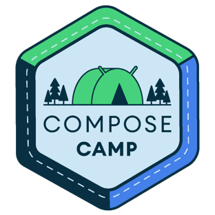
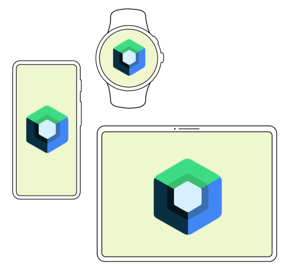

# Compose Camp 22 - GDSC-TMSL

Compose Camp 22 by GDSC-TMSL provides a great oppourtunity for you to learn with your peers the art of creating a native android app with super simple to use Jetpack Compose UI Toolkit

## The camp will be starting from **8th Septempber 2022**

## There will be two tracks to choose from -

- **Begineer Track**: If you are a novice at android development this is for you.

- **Expert Track**: If you already have some experience with traditional android development and would like to try this new way of developing apps this is for you

## Timeline

- ### The course will consist of **5 sessions (3 online, 2 in person)**

- 8th Sep 22 (Unit 1) _ONLINE_

- 12th Sep 22 (Unit 2) _ONLINE_

- 15th Sep 22 (Unit 3, surpise module 1) _ONLINE_

- 20th Sep 22 (Unit 4, app team assignment, surpise module 2) _In Person_

- 24th Sep 22 (Final Day, Public App display) _In Person_

- ### At end of the course you will be given a week to create something of your own with the things you have learnt and showcase it to the public offline on stage

- `Two surprise 🤩 bonus modules that will help your app stand out`

## All the course materials will be uploaded here in this repo so make sure to star(⭐) this repo

## Why Jetpack Compose ?? 🤔

- `Less code` - Do more with less code and avoid entire classes of bugs. Code is simpler and easier to maintain.

- `Intuitive` - Just describe your UI, and Compose takes care of the rest. As app state changes, your UI automatically updates.

- `Accelerates Development` - Compatible with all your existing code so you can adopt when and where you want. Iterate fast with live previews and full Android Studio support.

- `Powerful` - Create beautiful apps with direct access to the Android platform APIs and built-in support for Material Design, Dark theme, animations, and more.

### Compose apps are written in the [Kotlin](https://developer.android.com/kotlin) programming language

### Kotlin is the language that the majority of professional Android developers use to build apps. Kotlin provides you the rock solid stability and reliable JVM with a very concise and readable syntax

### So lets embark on this beautiful and exciting journey with your friends and peers to unleash the true power of community learning and hope to see you guys onboard
