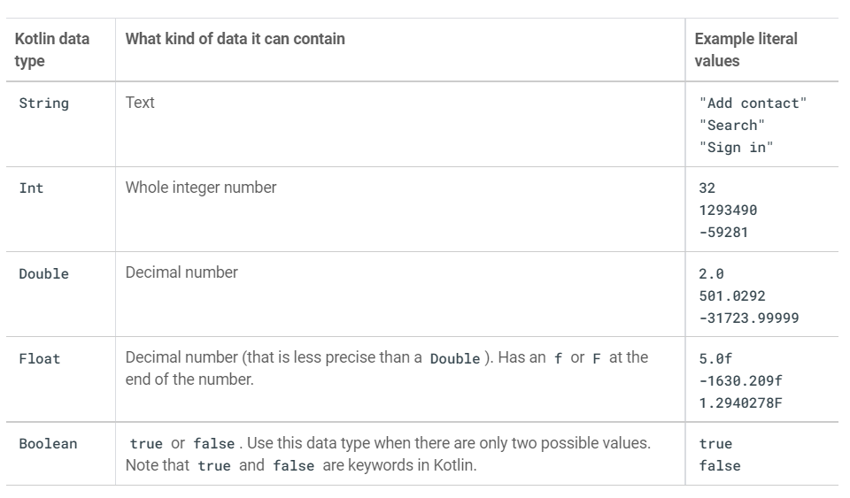
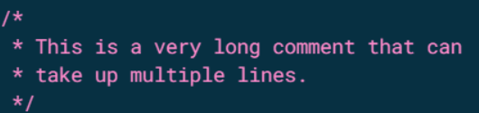
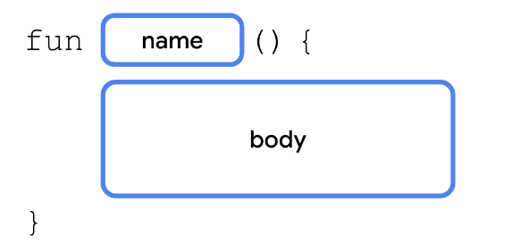

# Unit 1: Your first Android App

## Week 1 Task

Make sure to go through these training modules before day 2 of the camp.

- [Introduction to Kotlin](https://developer.android.com/courses/pathways/android-basics-compose-unit-1-pathway-1?hl=en)

- [Set up Android Studio](https://developer.android.com/courses/pathways/android-basics-compose-unit-1-pathway-2?hl=en)

- [Build a basic layout](https://developer.android.com/courses/pathways/android-basics-compose-unit-1-pathway-3?hl=en)

## Kotlin 101

**What is Kotlin?**

Kotlin is a modern programming language that helps developers be more productive. For example, Kotlin allows you to be more concise and write fewer lines of code for the same functionality compared to other programming languages. Apps that are built with Kotlin are also less likely to crash, resulting in a more stable and robust app for users. Essentially, with Kotlin, you can write better Android apps in a shorter amount of time. As a result, Kotlin is gaining momentum in the industry and is the language that the majority of professional Android developers use.

**Getting Started with Kotlin:**

To practice the basics of the Kotlin language, you will use an interactive code editor called the Kotlin Playground. You can access it from a web browser, so you don't need to install any software on your computer. You can edit and run Kotlin code directly in the Kotlin Playground and see the output. But you can’t build android apps here.

[Kotlin Playground](https://developer.android.com/training/kotlinplayground)

**Hello World with Kotlin:**

`code`

```kotlin
fun main(){
    println("Hello Word!")
}
```

`output`

```sh
    Hello World!
```

**How did it work:**

The kotlin compiler always takes the function `main` as its starting point. And then executes the code line by line like a cooking recipe

- In kotkin we declare a function with the fun keyword followed by the function name and a pair of parentheses or first brackets in layman language. We give any function any name but a function with the name main should always be there as a starting point for the execution of code

- The line _Hello, world!_ is printed to the output because of the builtin function `println()` which means print line and the line is printed in the output section

**Create and Use variables in Kotlin:**

There are two(2) ways to create variables in kotlin.

- **val** keyword: It is used to create a read only variable or constants. These variables will not change their value with the progress of code execution.

- **Var** keyword: It is used to create variables which can change their value with the progress of code execution.

Different data types supported by kotlin:


**Variable declaration & Usage:**

`code`

```kotlin
fun main() {
    val count:Int = 2
    println(count)
}
```

`output`

```sh
2
```

`code`

```kotlin
fun main() {
    var carTotal:Int = 0
    carTotal = 20
    println(carTotal)
}
```

`output`

```sh
20
```

This is how you use variables in kotlin. 99% of the time kotlin infers the data type from the value. So, you can most probably skip the :Int part.


**String Interpolation in kotlin:**


Here in the println() line, anything written within `${}` represents the dynamic part of the string.
This contains kotlin code which will be evaluated and its results will be replaced in place in the output string.

**Commenting on your code:**

This is a single line comment


This is a multi line comment


**Dealing with functions in kotlin:**

The general syntax



**Defining and calling function:**

Let us define a custom function called birthdayGreeting() and write some code in it. As main is the starting point of execution of kotlin code I’m calling the function from there.


**Function with a return value:**

This is the syntax of the function which returns some output on the basis of the input given


The below function returns a `String` type data


**Special Mention void/Unit return type:**

In other statically typed general programming languages like java or c++ when a function does not return anything this is called _void_ return type. In kotlin the same thing is called `Unit` return type. It is optional to write `:Unit`

The below two functions are same


```kotlin
fun birthdayGreeting() {
    println("Happy Birthday, Rover!")
    println("You are now 5 years old")
}
```

**Parameters vs Arguments:**

Many times the words parameters and arguments are used interchangeably but they are different. Lets properly clear the confusion

```kotlin
fun main() {
   birthdayGreeting("Android")
}
fun birthdayGreeting(name:String) {
   println("Happy Birthday, $name!")
   println("You are now 5 years old")
}
```

Here `Android` is arguement and `name` is parameter

**Function with multiple parameters:**
This is an example of a function which accepts multiple parameters


**Named Argument:**

In the previous example of `birthdayGreeting()`, you didn't need to specify the parameter names, name or age, when you called a function. However, you're able to do so if you choose. For example, you may call a function with many parameters or you may want to pass your arguments in a different order, such as putting the age parameter before the name parameter. When you include the parameter name when you call a function, it's called a `named argument`

`code:`

```kotlin
 fun main() {
    birthdayGreeting(name="Android", age=5)
    birthdayGreeting(age=5,name="Android",)
 }
 fun birthdayGreeting(name:String, age:Int) {
    println("Happy Birthday, $name!")
    println("You are now $age years old")
}
```

`output:`

```sh
Happy Birthday, Android!
You are now 5 years old
Happy Birthday, Android!
You are now 5 years old
```

**Default Arguments:**

Function parameters can also specify default arguments. Maybe Rover is your favorite dog, or you expect a function to be called with specific arguments in most cases. When you call a function, you can choose to omit arguments for which there is a default, in which case, the default is used.

`code:`

```kotlin
 fun main() {
    birthdayGreeting(name="Android", age=12)
    birthdayGreeting(age=15)
 }
 fun birthdayGreeting(name:String="Google", age:Int) {
    println("Happy Birthday, $name!")
    println("You are now $age years old")
}
```

`output:`

```sh
Happy Birthday, Android!
You are now 12 years old
Happy Birthday, Google!
You are now 15 years old
```

## Setting Up Android Studio

Download Android Studio
Open any web browser and navigate to the [Android Studio download page](https://developer.android.com/studio/?gclid=Cj0KCQiAjJOQBhCkARIsAEKMtO3zEhdK4_I0CEZic3UH4dl-9gVXuHFR9dCl3TOHKjmv3xWLU3UxfhYaApfAEALw_wcB&gclsrc=aw.ds).
This is the Android Developers website, where you can download Android Studio. This page automatically detects your operating system.

Click Download Android Studio. The Terms and Conditions page with the Android Studio License Agreement opens.
Read the License Agreement.
At the bottom of the page, if you agree with the terms and conditions, select the I have read and agree with the above terms and conditions checkbox.
Click Download Android Studio to start the download.
When prompted, save the file to a location where you can easily locate it, such as the Downloads folder.
Wait for the download to complete. This may take a while and may be a good moment to enjoy some tea!
Install Android Studio on Windows
Open the folder where you downloaded and saved the Android Studio installation file.
Double-click the downloaded file.
If you see a User Account Control dialog about allowing the installation to make changes to your computer, click Yes to confirm the installation.


The Welcome to Android Studio Setup dialog displays.


Click Next to start the installation.
Accept the default installation settings for all steps.
Click Finish when the installation is done to launch Android Studio.


Choose your preference of light or dark theme when Android Studio first launches. Screenshots in this course use the light theme, but choose whichever one you prefer.


During the installation, the setup wizard downloads and installs additional components and tools needed for Android app development. This may take some time depending on your internet speed. During this time, you may see a User Account Control dialog for Windows Command Processor. Click Yes to accept the dialog.


You may also receive a Windows Security Alert about adb.exe. Click Allow Access, if needed, to continue the installation.


When the download and installation completes, click Finish.
The Welcome to Android Studio window displays and you're ready to start creating apps!


