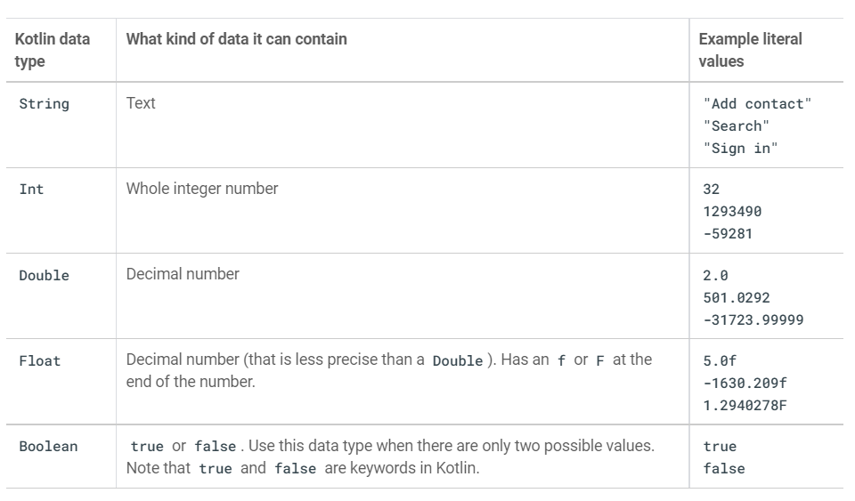
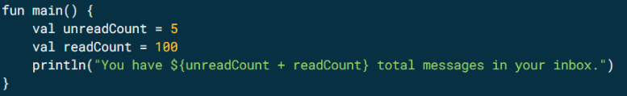
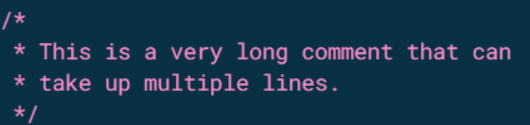
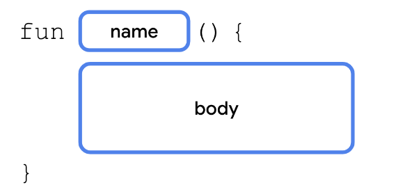

# Unit 1: Your first Android App

## Pathway 1

### Introduction to Kotlin

**What is Kotlin?**

Kotlin is a modern programming language that helps developers be more productive. For example, Kotlin allows you to be more concise and write fewer lines of code for the same functionality compared to other programming languages. Apps that are built with Kotlin are also less likely to crash, resulting in a more stable and robust app for users. Essentially, with Kotlin, you can write better Android apps in a shorter amount of time. As a result, Kotlin is gaining momentum in the industry and is the language that the majority of professional Android developers use.

**Getting Started with Kotlin:**

To practice the basics of the Kotlin language, you will use an interactive code editor called the Kotlin Playground. You can access it from a web browser, so you don't need to install any software on your computer. You can edit and run Kotlin code directly in the Kotlin Playground and see the output. But you can’t build android apps here.

[Kotlin Playground](https://developer.android.com/training/kotlinplayground)

**Hello World with Kotlin:**

`code`

```kotlin
fun main(){
    println("Hello Word!")
}
```

`output`

```sh
    Hello World!
```

**How did it work:**

The kotlin compiler always takes the function `main` as its starting point. And then executes the code line by line like a cooking recipe

- In kotkin we declare a function with the fun keyword followed by the function name and a pair of parentheses or first brackets in layman language. We give any function any name but a function with the name main should always be there as a starting point for the execution of code

- The line _Hello, world!_ is printed to the output because of the builtin function `println()` which means print line and the line is printed in the output section

**Create and Use variables in Kotlin:**

There are two(2) ways to create variables in kotlin.

- **val** keyword: It is used to create a read only variable or constants. These variables will not change their value with the progress of code execution.

- **Var** keyword: It is used to create variables which can change their value with the progress of code execution.

Different data types supported by kotlin:


**Variable declaration & Usage:**

`code`

```kotlin
fun main() {
    val count:Int = 2
    println(count)
}
```

`output`

```sh
2
```

`code`

```kotlin
fun main() {
    var carTotal:Int = 0
    carTotal = 20
    println(carTotal)
}
```

`output`

```sh
20
```

This is how you use variables in kotlin. 99% of the time kotlin infers the data type from the value. So, you can most probably skip the :Int part.


**String Interpolation in kotlin:**



Here in the println() line, anything written within `${}` represents the dynamic part of the string.
This contains kotlin code which will be evaluated and its results will be replaced in place in the output string.

**Commenting on your code:**

This is a single line comment


This is a multi line comment


**Dealing with functions in kotlin:**

The general syntax


**Defining and calling function:**

Let us define a custom function called birthdayGreeting() and write some code in it. As main is the starting point of execution of kotlin code I’m calling the function from there.

